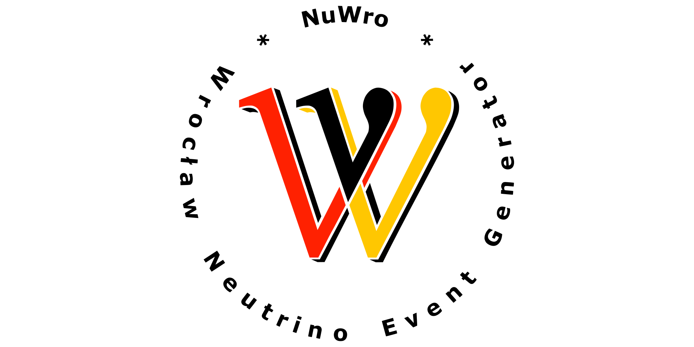

NuWro is a Monte Carlo neutrino event generator. It has been developed since 2006 at the University of Wroclaw. It includes all basic dynamics for neutrino scattering processes (for both neutral and charged currents):

* (quasi-) elastic scattering
* single pion production through Delta(1232) resonance (including non-resonant background)
* *deep inelastic scattering* (or in other words - more inelastic than Delta resonance)
* two-body current contribution to (quasi-) elastic scattering
* coherent pion production

In the first three cases interactions occur on a single nucleon from a nucleus in the Impulse Approximation regime. Two-body current scattering goes beyond Impulse Approximation and neutrino interacts with at least two nucleons. Coherent pion production occurs on a whole nucleus. For all dynamics, but the coherent, the primary vertex is followed by final state interactions based on the intra-nuclear cascade model.

NuWro provides a multiplicity of choices for a description of a target nucleus, including Fermi gas and spectral function. It also contains various parameterizations of nuclear form factors. Many quantum effects, like Pauli blocking or formation zone, are included.

The generator has a detector geometry module and can handle realistic neutrino beams. All together
makes NuWro a complete tool to use in neutrino experiments.

This wiki describes technical aspect of using NuWro rather than physics implemented in the generator. For the latter please see [the publication list](references).
